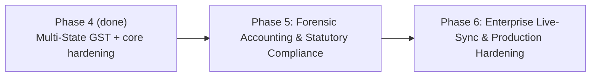

# SSDV blueprint (v1 baseline + Enterprise roadmap)

Status: v1 baseline is documented below. Enterprise roadmap (Phase 5/6) is appended for production hardening and statutory expansion.

## Company

| Item | Value |
| --- | --- |
| Legal name | ABC Industrial Supplies Private Limited |
| Trade | Electrical & industrial products distributor |
| GSTIN state | Maharashtra (27) |
| Registration | Regular GST dealer |
| Branches | 5 |
| Warehouses | 3 |
| Banks | HDFC current, ICICI current, HDFC OD (limit only) |
| Employees | 50 |

## Calendar

Indian financial years, not calendar years.

| FY | Dates | Revenue target |
| --- | --- | ---: |
| FY 2023-24 | 1 Apr 2023 – 31 Mar 2024 | ₹8 Cr |
| FY 2024-25 | 1 Apr 2024 – 31 Mar 2025 | ₹10 Cr |
| FY 2025-26 | 1 Apr 2025 – 31 Mar 2026 | ₹13 Cr |

Skip Sundays and the holiday list in `config/holidays.yaml`. Opening voucher date: **1 Apr 2023**.

## Volumes (targets)

Journals, stock moves, and bank rows are **derived**. Do not target them.

| Master / document | Count |
| --- | ---: |
| Customers | 1,200 |
| Vendors | 200 |
| Products | 350 |
| Sales invoices | 5,000 |
| Purchase invoices | 2,500 |
| Receipts | 4,500 |
| Payments | 3,500 |
| Credit / debit notes | small, required |

Customer activity (not uniform): ~15% core monthly, ~35% regular quarterly, ~50% occasional. Average sales invoice ~₹62,000.

## Accounting rules

1. Every operational event calls `post()`. No generate-then-journal-later path.
2. Debit = credit on every voucher or the voucher is rejected.
3. Inventory: perpetual, **weighted average**. No negative quantity.
4. Sales post AR + output GST and COGS + inventory in the same voucher. Dispatch is same-day as the invoice. COGS is at weighted-average cost, not selling price.
5. Purchases post inventory + input GST + AP. In v1 the GRN is same-day as the bill; stock is received at pre-tax cost (ITC is not inventoried).
6. Receipts: Bank Dr / AR Cr, allocated to an invoice or to opening AR. Payments: AP Dr / Bank Cr, allocated to a bill or to opening AP. Collection mix ~40% early / 35% on-time / 15% late / 10% overdue. Current accounts may not go negative; OD floor is −₹25 lakh.
7. Intra-state: CGST + SGST. Inter-state: IGST. Place of supply = customer/vendor state vs MH.
8. Opening: capital, cash/bank, furniture, term loan; **party-wise AR/AP** on control accounts; **SKU opening stock** whose value equals the inventory GL.
9. Monthly opex (salary, rent, utilities) is accrued to salary/expense payable, then paid from bank when cash allows. Bank charges hit the bank or accrue. Term-loan EMI splits interest and principal; unpaid months accrue interest only.
10. GST: monthly ITC set-off against output, net to GST Payable, paid by the 20th of the next month when cash allows.
11. Year-end: depreciate furniture SLM 10%; close income and expense to the P&L equity account. Never leave BS unbalanced.
12. Cash/bank may not breach the OD limit.
13. Generator seed is fixed in the company YAML so datasets are reproducible.

## Voucher types

`OPENING`, `PURCHASE`, `SALE`, `RECEIPT`, `PAYMENT`, `EXPENSE`, `JOURNAL`, `CONTRA`, `CREDIT_NOTE`, `DEBIT_NOTE`, `DEPRECIATION`, `CLOSING`, `GST_PAYMENT`.

## GST (v1)

Default rate 18%. Product mix may include 12% and 28%. HSN on every SKU. GSTR-1 and GSTR-3B are extracts from the invoice/tax registers, and must match GST ledgers.

## AI scenarios (separate seeds, not all at once)

| Seed | Name | Known cause |
| --- | --- | --- |
| `baseline` | Healthy growth | Sales, profit, and cash all rise |
| `customer_concentration` | Concentration | Top customer ~40% of revenue |
| `cash_flow_crisis` | Collections lag | Sales up, DSO up, cash down |
| `inventory_buildup` | Excess stock | Inventory up, sales flat |
| `vendor_dependency` | Supplier risk | One vendor >60% of purchases |
| `margin_erosion` | Cost shock | Purchase cost up, selling price lag |

## Validation gates

- Debit = credit on every voucher
- Assets = liabilities + equity + YTD P&L, every month-end
- AR control = open invoices + remaining opening AR − receipts (document outstanding and aging totals)
- AP control = open bills + remaining opening AP − payments (document outstanding and aging totals)
- Inventory GL = qty × weighted average
- Bank GL = opening + receipts − payments; current accounts ≥ 0; OD ≥ −limit
- GSTR tax totals = GST ledgers
- Each scenario has a golden explanation string for OfficeMitra AI (`ssdv explain`)

Scenarios write to `data/ssdv_<scenario>.sqlite` so the baseline vault is left intact.

## Out of v1

FastAPI, Streamlit, PostgreSQL, Power BI, manufacturing/retail/temple/society datasets, e-invoice, e-way bill, PF/ESI, CRM conversion KPIs.

## Enterprise Roadmap (Phases 5 & 6)

Recommended next-level enhancements for production deployments, CA firms, and multi-entity enterprises.

### Phase 5: Forensic Accounting & Statutory Compliance

1. **Section 43B(h) MSME Overdue Analyzer**
   - party-level MSME classification tags (Micro, Small, Medium)
   - automated 43B(h) disallowance risk report in the CFO pack
2. **GSTR-2B vs. Inward ITC Reconciliation**
   - ingest monthly GSTR-2B JSON/CSV
   - reconcile inward purchase vouchers with tolerance matching on invoice no/date/GST amount
   - flag uncredited ITC, missing vendor invoices, and ineligible credits
3. **Schedule III Financial Statement Generator**
   - standardized Balance Sheet and P&L grouping into Ind AS Schedule III
   - automated note numbering
4. **DuPont Diagnostic Engine**
   - deconstruct ROE into:
     - Profit Margin
     - Asset Turnover
     - Financial Leverage
   - executive “driver tree” explanations

### Phase 6: Enterprise Live-Sync & Production Hardening

1. **Direct TallyPrime HTTP Listener — done** (`ssdv connect --source tally-http`)
   - connect to Tally’s local XML HTTP port (e.g. `http://localhost:9000`)
   - extract DayBook and Master vouchers on demand (no manual CSV/XML exports)
2. **Database Engine Switch (PostgreSQL / ClickHouse)**
   - SQLAlchemy URL configuration support:
     - `postgresql+psycopg2://...`
   - motivations: multi-user concurrency and higher transaction volumes
3. **Multi-Entity Group Consolidation**
   - load multiple company vaults (holding + subsidiaries)
   - inter-company elimination vouchers
   - consolidated Group MIS packs
4. **Automated Scheduled Dispatch**
   - background worker to compile Board Pack PDFs and Excel workbooks at month-end
   - dispatch via SMTP or secure webhook
