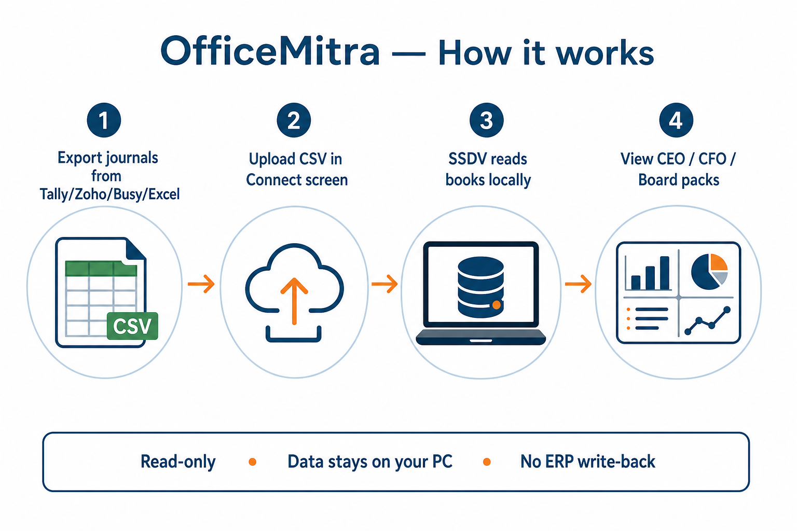
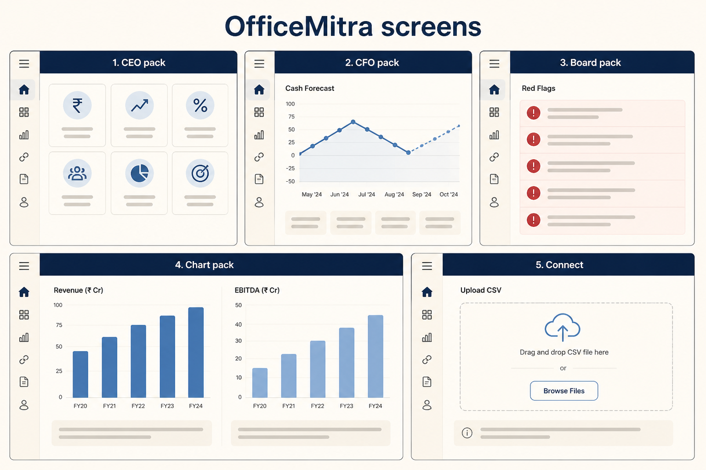
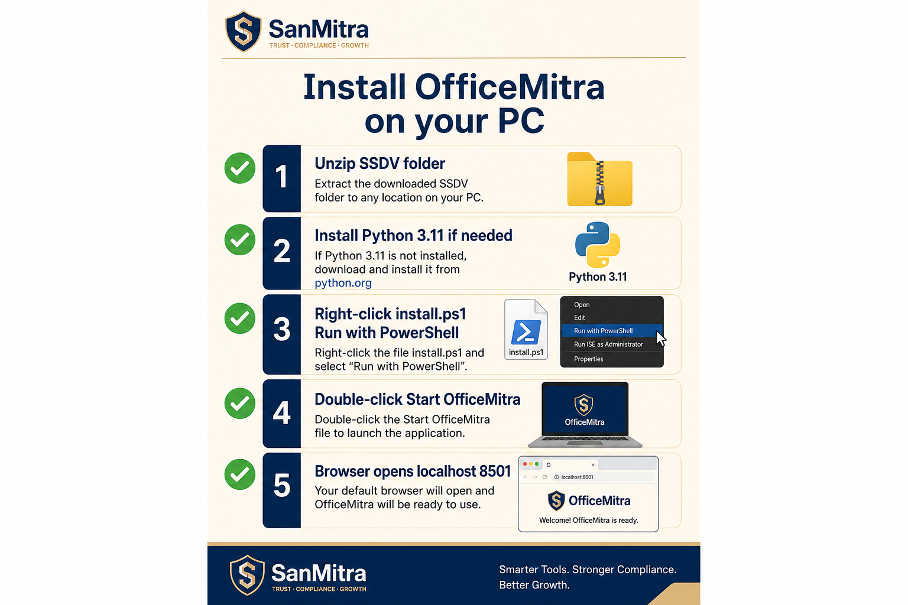

# OfficeMitra — Client user manual

**SanMitra Synthetic Data Vault (SSDV) + OfficeMitra dashboard**

| | |
| --- | --- |
| **Product** | OfficeMitra — AI business analyst for SMEs (read-only MIS from posted journals) |
| **Publisher** | SanMitra Technologies |
| **Website** | [https://www.sanmitratech.in](https://www.sanmitratech.in) |
| **Support email** | [contact@sanmitratech.in](mailto:contact@sanmitratech.in) |

---

## Table of contents

1. [Welcome](#1-welcome)
2. [What OfficeMitra does](#2-what-officemitra-does)
3. [Install on your PC](#3-install-on-your-pc)
4. [Daily workflow](#4-daily-workflow)
5. [The five screens (packs)](#5-the-five-screens-packs)
6. [Connect your accounting software](#6-connect-your-accounting-software)
7. [Workflow tips](#7-workflow-tips)
8. [Glossary (plain English)](#8-glossary-plain-english)
9. [Common errors and fixes](#9-common-errors-and-fixes)
10. [FAQs](#10-faqs)
11. [Optional: Ask Why (AI)](#11-optional-ask-why-ai)
12. [Backup and safety](#12-backup-and-safety)
13. [Support](#13-support)

---

## 1. Welcome

OfficeMitra turns your **exported accounting journals** into clear **CEO, CFO, and Board** views — KPI tiles, charts, red flags, cash forecast, customer/vendor lists, and a downloadable Board PDF.

**Important:** OfficeMitra runs **on your computer**. Your books are stored in a local file (`data\ssdv_connect.sqlite`). SanMitra does not receive your data unless **you** choose to send an export or screenshot for support.



---

## 2. What OfficeMitra does

### OfficeMitra **is**

- A **read-only** analytics tool on top of double-entry journals
- A way to see **CEO / CFO / Board** packs without building spreadsheets
- A **local** app — works after install even without internet (except optional AI)
- Compatible with exports from **Tally, Zoho Books, Busy, Excel**, and similar tools (via CSV)

### OfficeMitra **is not**

- Tally, Zoho, Busy, or MitraBooks — it does not replace your ERP
- A live login to your accounting software
- Something that **changes** your books or posts vouchers back to your ERP
- A statutory books-of-record replacement

### Who uses which screen?

| Role | Start here | Why |
| --- | --- | --- |
| **Owner / CEO** | CEO pack | Revenue, margin, cash, collections, what-if ideas |
| **Finance / CA / CFO** | CFO pack | DSO, aging, GST, bank, 30/60/90 cash forecast, vendors |
| **Director / Board** | Board pack | Red flags, policy scorecard, benchmarks, PDF for meetings |
| **Analyst** | Chart pack | Trends and aging charts |
| **First-time setup** | Connect | Upload your CSV export |



---

## 3. Install on your PC

**Quick guide:** [CLIENT_INSTALL.md](CLIENT_INSTALL.md)



### Summary

1. Unzip the SSDV folder (for example `D:\SSDV`).
2. Install **Python 3.11+** from [python.org](https://www.python.org/downloads/) if needed — tick **Add to PATH**.
3. Right-click **`install.ps1`** → **Run with PowerShell**.
4. Double-click **`Start-OfficeMitra.bat`**.
5. Browser opens **http://localhost:8501**.

### After install — create a desktop shortcut (optional)

1. Right-click `Start-OfficeMitra.bat` → **Send to** → **Desktop (create shortcut)**.
2. Rename the shortcut to **OfficeMitra**.

---

## 4. Daily workflow

```text
┌─────────────────┐     ┌──────────────────┐     ┌─────────────────────┐
│ Export journals │ ──► │ Connect (upload) │ ──► │ CEO / CFO / Board   │
│ from ERP/Excel  │     │ in OfficeMitra   │     │ packs + Board PDF   │
└─────────────────┘     └──────────────────┘     └─────────────────────┘
```

### Typical month-end cycle

| Step | Action |
| --- | --- |
| 1 | Export day book / journal register from Tally (or Zoho / Busy / Excel) as **CSV** |
| 2 | Start OfficeMitra (`Start-OfficeMitra.bat`) |
| 3 | Sidebar → **Connect** → upload CSV + ledger map |
| 4 | Set **As of** to your report date (usually month-end or year-end) |
| 5 | Review **CEO pack** (performance), **CFO pack** (cash & aging), **Board pack** (red flags) |
| 6 | **Download Board pack (PDF)** for the meeting |
| 7 | Close browser; **Ctrl+C** in the black window to stop |

### Which database (vault) am I using?

| Vault file | Meaning |
| --- | --- |
| `data\ssdv_connect.sqlite` | **Your company** — created when you use Connect |
| `data\ssdv.sqlite` | **Demo company** (ABC Industrial) — for training only |

In the sidebar **Vault** dropdown, pick the file that matches your company.

---

## 5. The five screens (packs)

Use the sidebar **Screen** radio buttons.

| Screen | What you see |
| --- | --- |
| **CEO pack** | KPI tiles, AI notes, top overdue customers, benchmarks, what-if scenarios, sales vs COGS, profit charts, Ask Why |
| **CFO pack** | Cash 30/60/90 forecast, DSO/DIO/DPO/CCC, GST, bank position, AR/AP aging, top customers & vendors |
| **Board pack** | Red flags first, balance sheet tiles, policy scorecard, benchmarks, top party tables |
| **Chart pack** | Activity, cash movement, margin, P&L mix, monthly profit, aging charts |
| **Connect** | Upload journal CSV + ledger map (read-only extract) |

### Downloads on every pack screen

| Button | Output |
| --- | --- |
| **Download full report (HTML)** | Printable CEO-style report — open in Edge, **Ctrl+P** to save as PDF |
| **Download Board pack (PDF)** | A4 Board summary — red flags, scorecard, benchmarks, cash forecast, what-if |

---

## 6. Connect your accounting software

OfficeMitra does **not** log into your ERP. You **export** a CSV and upload it.

### Tally (typical path)

1. In Tally: **Display → Account Books → Day Book** (or Journal register).
2. Export to **Excel/CSV**.
3. Ensure **one row per debit or credit line** (not one row per voucher total).
4. Map ledger names using `ledger_map.csv` (see examples folder).

### Zoho Books / Busy

1. Export **journal** or **day book** report to CSV.
2. Same column rules as below.

### Required CSV shape (simple view)

Your file should look like this (column names can use common aliases):

```text
voucher_id, date, voucher_type, account, debit, credit, party, narration
```

- Each **voucher_id** must **balance** (total debits = total credits).
- **date** format: `YYYY-MM-DD` (example `2025-03-31`).
- **account** = ledger name from your ERP (mapped via ledger map file).

Sample files: `examples\generic_ingest\journals.csv` and `ledger_map.csv`.

### Ledger map (strongly recommended)

A second small CSV tells OfficeMitra how your ledger names map to account codes:

```text
source,account_code
HDFC Bank,111000
Sundry Debtors,120000
Sales Account,410000
```

Without a map, every account name in your export must already be a valid code.

### In the Connect screen

1. **Journal CSV** — required  
2. **Ledger map** — recommended  
3. **Company name** — appears on reports  
4. **Replace books** — tick when reloading a full fresh export  
5. Click **Extract and post into SSDV**  
6. Switch to **CEO pack** and set **As of** date  

---

## 7. Workflow tips

### Tip 1 — Set the correct **As of** date

The dashboard shows figures **as at** the date you pick. If you choose a date **after** your year-end with no transactions in the new year, sales may show **zero** or “revenue decreased 100%”. Use your **actual last voucher date** (for example **31 Mar 2026** for year-end).

Shortcut: click **Use ABC year-end 31 Mar 2026** when viewing the demo vault only.

### Tip 2 — CEO Monday, CFO Wednesday, Board Friday

- **Monday:** CEO pack — sales, margin, collections, what-if  
- **Mid-week:** CFO pack — cash forecast, aging, GST, top overdue customers  
- **Before board meeting:** Board pack + **Download Board pack (PDF)**

### Tip 3 — Collection action from CFO pack

Open **CFO pack** → scroll to **Customer & vendor intelligence** → **Top overdue customers**. This list is ranked from **posted** AR aging (recommend-only; OfficeMitra does not send reminders).

### Tip 4 — Keep the black window open

While using the browser dashboard, the PowerShell window running `Start-OfficeMitra.bat` must stay open. Closing it stops OfficeMitra.

### Tip 5 — Refresh books without reinstalling

New month export → **Connect** → tick **Replace books** → upload → **Extract**. No need to run `install.ps1` again.

### Tip 6 — Print a full-page report

Browser screenshots often cut off content. Instead: **Download full report (HTML)** → open file in Edge → **Ctrl+P** → Save as PDF.

---

## 8. Glossary (plain English)

| Term | Meaning |
| --- | --- |
| **AR** | Money customers owe you (receivables) |
| **AP** | Money you owe vendors (payables) |
| **DSO** | Average days to collect from customers — lower is better |
| **DPO** | Average days you take to pay vendors |
| **CCC** | Cash conversion cycle — how long cash is tied up in operations |
| **Gross margin** | Sales minus cost of goods sold, as a % |
| **Collection efficiency** | Receipts ÷ sales — are you collecting what you bill? |
| **AR 90+** | Receivables overdue more than 90 days |
| **Red flag** | Board-level exception (policy breach, negative cash, etc.) |
| **What-if** | Recommendation only — “if DSO improved…” — books are **not** changed |
| **Vault** | The SQLite file holding posted journals for one book |

More detail: [USER_MANUAL.md](USER_MANUAL.md) section 9.

---

## 9. Common errors and fixes

| What you see | What to do |
| --- | --- |
| **OfficeMitra is not installed yet** | Run `install.ps1` first |
| **Python not found** | Install Python 3.11+ from python.org; tick **Add to PATH**; run `install.ps1` again |
| **Streamlit is not installed** | Do not use global Python. Run `install.ps1` or use `Start-OfficeMitra.bat` |
| **Browser does not open** | Manually open **http://localhost:8501** |
| **Blank page / cannot connect** | Check the black window is still open; restart `Start-OfficeMitra.bat` |
| **Wrong company numbers** | Sidebar **Vault** — pick `ssdv_connect.sqlite` for your data, not demo `ssdv.sqlite` |
| **Sales zero / revenue down 100%** | **As of** date is wrong — use last date in your CSV |
| **Unmapped ledger** | Add that ledger name to your **ledger map** CSV |
| **Unbalanced voucher** | One voucher_id has debits ≠ credits — fix in export or source ERP |
| **Connect vault already has data** | Tick **Replace books** or use `--force` in CLI |
| **Script blocked by Windows** | Run PowerShell as admin once: `Set-ExecutionPolicy -Scope CurrentUser RemoteSigned` — or use **Run with PowerShell** on `install.ps1` |
| **Ask Why does nothing** | Ollama is optional — install separately; KPI packs work without it |
| **Edge screenshot cuts off page** | Use **Download full report (HTML)** or **Board pack (PDF)** |

Still stuck? Email **contact@sanmitratech.in** with screenshots.

---

## 10. FAQs

### Do I need internet after install?

**No**, for normal KPI packs and Connect. Internet is needed only for first-time install (Python packages) and optional Ollama model download.

### Does SanMitra see my books?

**No**, unless you email files or screenshots to support. Everything runs locally in your SSDV folder.

### Can I install on multiple PCs?

**Yes.** Install on each PC separately. Copy `data\ssdv_connect.sqlite` to move books between machines (same company vault file).

### Does it work with Tally Prime?

**Yes**, via CSV export + Connect. Native live Tally API is not required.

### Will it change my Tally / Zoho data?

**Never.** SSDV is read-only. It only reads the CSV you upload.

### Can my CA use the same install?

**Yes.** Share the SSDV folder or just the vault file + exports. Many CAs use **CFO pack** and **Board PDF**.

### What file should I back up?

`data\ssdv_connect.sqlite` — this is your connected company vault.

### Is there a Mac version?

The app is Python-based and can run on Mac/Linux with manual setup. This manual covers **Windows**; contact SanMitra for Mac install assistance.

### What is the demo ABC company?

`data\ssdv.sqlite` is a generated training company (ABC Industrial Supplies). Use it to explore features before loading your own CSV.

### What-if scenarios — are they real forecasts?

They are **recommend-only** calculations from **posted** facts (for example “if DSO were 120 days…”). They do not change journals and are not a substitute for a full budget model.

### Industry benchmarks?

OfficeMitra compares to **SSDV policy bands** and an optional **ABC baseline** demo peer — not a national industry survey.

---

## 11. Optional: Ask Why (AI)

**Ask Why** (CEO pack chips and typed questions) uses **local Ollama** with a language model. It is **optional** — all KPIs, charts, PDFs, and party lists work without AI.

To enable:

1. Install [Ollama](https://ollama.com/) on the same PC.
2. Run model: `llama3.1:8b` (requires sufficient RAM).
3. Use chips like “Why did profit fall?” on the CEO pack.

The AI may only use numbers from your posted books — it must not invent customers or causes.

---

## 12. Backup and safety

| Do | Don't |
| --- | --- |
| Back up `data\*.sqlite` regularly | Run `init --force` on a vault unless SanMitra/CA tells you to |
| Keep exports (CSV) in a dated folder | Paste PowerShell **output** back as commands |
| Use **Replace books** for full reloads | Share vault files over unsecured channels without consent |
| Contact support before reinstalling if unsure | Install SSDV into **global** Python (breaks other tools) |

---

## 13. Support

**SanMitra Technologies**

| Channel | Details |
| --- | --- |
| **Email** | [contact@sanmitratech.in](mailto:contact@sanmitratech.in) |
| **Website** | [https://www.sanmitratech.in](https://www.sanmitratech.in) |

### When contacting support, please send

1. Your **company name** (as entered in Connect)  
2. **Windows version** (Settings → System → About)  
3. **What you tried** (install, Connect, which screen)  
4. **Screenshot** of the error or sidebar (vault + as-of date visible)  
5. Whether you use **Tally / Zoho / Busy / Excel**  

We typically respond with step-by-step guidance for install, CSV mapping, and dashboard use.

### Related documents

| Document | Audience |
| --- | --- |
| [CLIENT_INSTALL.md](CLIENT_INSTALL.md) | Short install checklist |
| [USER_MANUAL.md](USER_MANUAL.md) | Full technical reference (CLI, CSV spec, developers) |
| [BLUEPRINT.md](BLUEPRINT.md) | Product rules and accounting design |

---

*© SanMitra Technologies. OfficeMitra / SSDV — read-only analytics from posted journals.*
