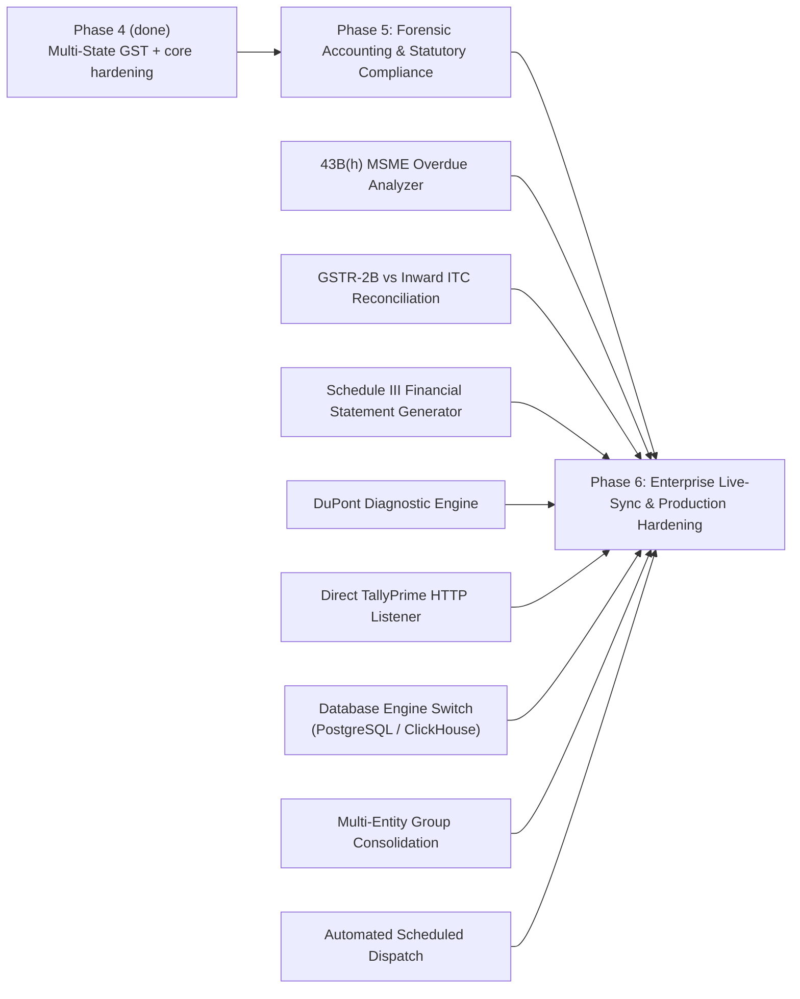

# Enterprise Roadmap (Phases 5 & 6)

Goal: scale SSDV / OfficeMitra for production-grade installs, CA firms, and multi-entity enterprises.

## Current Status (so far)

- `pytest` suite: **82/82 passing**
- Phase 1–4: integrated
- **Multi-State GST**: implemented and unit-tested (GST split now respects warehouse branch state)

## Mermaid Diagram

## Detailed Breakdown of Proposed Phases

### Phase 5: Forensic Accounting & Statutory Compliance

1. **Section 43B(h) MSME Overdue Analyzer**
   - Requirement: flag payment disallowance risk for MSMEs not paid within statutory time windows:
     - 45 days when agreement exists
     - 15 days when no agreement exists
   - Proposed vNext:
     - party-level MSME classification tags (Micro, Small, Medium)
     - automated 43B(h) disallowance risk report in CFO pack

2. **GSTR-2B vs Inward ITC Reconciliation**
   - Requirement: ingest monthly GSTR-2B and reconcile it against inward purchase vouchers.
   - Proposed matching:
     - Invoice No + Date
     - tolerance matching on GST amount
   - Proposed flags:
     - uncredited ITC
     - missing vendor invoices
     - ineligible credits

3. **Schedule III Financial Statement Generator**
   - Requirement: standardized Balance Sheet + P&L grouping into Ind AS Schedule III format.
   - Proposed output:
     - Division I / Division II grouping
     - automated note numbering

4. **DuPont Diagnostic Engine**
   - Requirement: deconstruct ROE into operational vs financing drivers:
     - Profit Margin
     - Asset Turnover
     - Financial Leverage
   - Output:
     - executive “driver tree” explanation per period

### Phase 6: Enterprise Live-Sync & Production Hardening

1. **Direct TallyPrime HTTP Listener**
   - Connect directly to Tally’s local XML HTTP port (e.g. `http://localhost:9000`)
   - Extract DayBook + Master vouchers on demand (no manual CSV/XML export)

2. **Database Engine Switch (PostgreSQL / ClickHouse)**
   - SQLAlchemy URL configuration support:
     - `postgresql+psycopg2://...`
   - Motivation:
     - multi-user concurrency
     - high transaction volume reporting

3. **Multi-Entity Group Consolidation**
   - Support multiple company vaults:
     - holding company + subsidiaries
   - Proposed approach:
     - inter-company elimination vouchers
     - consolidated Group MIS packs

4. **Automated Scheduled Dispatch**
   - Background worker (cron/task scheduler) to compile:
     - Board Pack PDFs
     - Excel workbooks
   - Dispatch:
     - SMTP email
     - secure webhook delivery

## Suggested Sequencing (Practical Monetization Order)

1. Phase 5.1 (43B(h) MSME risk) + Phase 5.2 (GSTR-2B reconciliation)
2. Schedule III + DuPont diagnostic
3. Live-sync (TallyPrime HTTP listener)
4. Consolidation + scheduled dispatch
5. Database engine switch once concurrency becomes a real constraint

